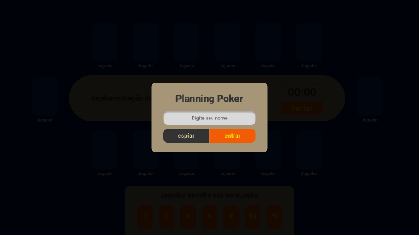

# Planning Poker

Planning Poker is a powerful and fun way to improve planning and estimation ceremonies for remote and in-person teams.

## Prerequisites

* .NET 6.0
* Visual Studio 2022 or VS Code
* Heroku CLI (optional deploy)

## Work in progress :warning: 

- [x] Backend service with SignalR
- [x] Backend game rules
- [x] Figma project layout
- [x] Deploy backend on Heroku
- [x] Deploy frontend on Github Pages
- [x] Frontend components design
- [x] Frontend application with Blazor
- [ ] User session to manage concurrency in game session
- [ ] Frontend components behaviors
- [ ] Frontend and Backend integration
- [ ] Ready to play!

## Screenshots

## Deploy backend on Heroku

[Heroku Doc](./docs/Heroku.md)

## References

https://swimburger.net/blog/dotnet/how-to-deploy-aspnet-blazor-webassembly-to-github-pages

## Developed by

* Angelito Casagrande (@angelitocsg)

Copyright © 2022 - Planning Poker